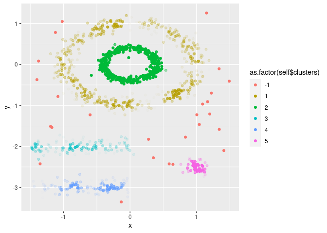
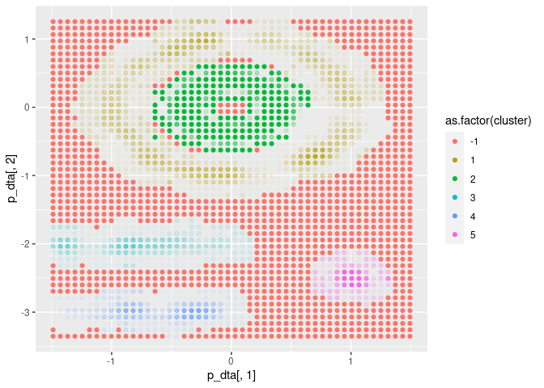

<!-- README.md is generated from README.Rmd. Please edit that file -->

# FuzzyDBScan

This package implements fuzzy DBScan with fuzzy core and fuzzy border.
Therefore, it provides a method to initialize and run the algorithm and
a function to predict new data w.t.h. of `R6`. The package is build upon
the paper “Fuzzy Extensions of the DBScan algorithm” from Dino Ienco and
Gloria Bordogna. The predict function assigns new data based on the same
criteria as the algorithm itself. However, the prediction function
freezes the algorithm to preserve the trained cluster structure and
treats each new prediction object individually.

## Installation

You can install the development version of FuzzyDBScan from
[GitHub](https://github.com/) with:

``` r
# install.packages("devtools")
devtools::install_github("henrifnk/FuzzyDBScan")
```

## Example

The following example shows how Fuzzy DBScan works with the
`multishapes` data set from the `factoextra` package. We set the range
of $\epsilon \in [0, 0.2]$. Note that setting $\epsilon_{min} = 0$
implies that we expect fuzzieness through the entire core. The range of
neighbors is set to the interval of $[3, 15]$ where $pts_{min} = 3$
means that we need at least three points to detect a fuzzy core point.

``` r
library(factoextra)
dta = multishapes[, 1:2]
eps = c(0, 0.2)
pts = c(3, 15)
```

Next, we train the DBScan based on `dta`, `eps` and `pts`. This is done
by initializing the `R6` object. `FuzzyDBScan` contains a scatterplot
method, where the clusters (colours) and fuzzieness (transparency) are
plotted for any two features.

``` r
library(FuzzyDBScan)
cl = FuzzyDBScan$new(dta, eps, pts)
cl$plot("x", "y")
```



`FuzzyDBScan` is equipped with a prediction method. This method freezes
the algorithm such that new data points are not used for updating the
cluster structure itself.\<s Each new data point is then assigned a
cluster and fuzziness individually by the same rules as during training.

``` r
x <- seq(min(dta$x), max(dta$x), length.out = 50)
y <- seq(min(dta$y), max(dta$y), length.out = 50)
p_dta = expand.grid(x = x, y = y)

p = cl$predict(p_dta, FALSE)
ggplot(p, aes(x = p_dta[, 1], y = p_dta[, 2], colour = as.factor(cluster))) +
  geom_point(alpha = p$dense)
```



## Reference

- Ienco, Dino, and Gloria Bordogna. [Fuzzy extensions of the DBScan
  clustering algorithm](https://doi.org/10.1007/s00500-016-2435-0). Soft
  Computing 22.5 (2018): 1719-1730.
